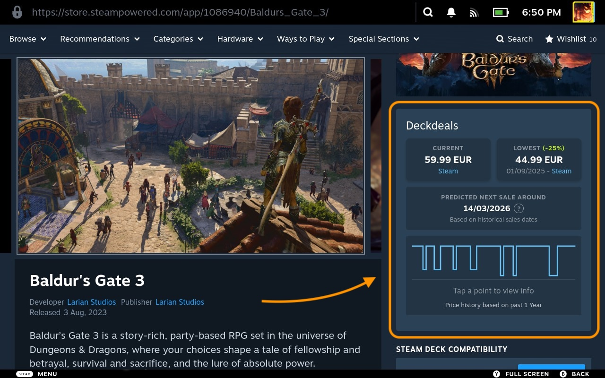

# Deckdeals
### Price History & Deals (BETA)

**Track prices, spot deals, and save money directly from the Steam Store.**

  

---

> [!NOTE]
> This is a **BETA** build. Features and UI are subject to change. I'm hoping to submit this to Decky shortly after I've had time to polish it to the fullest.

## Installation

You can install the plugin manually via the ZIP file:

1. Download the [optideck-deckdeals-v1.1.1-beta.zip](https://github.com/ebdevag/optideck-deckdeals/releases/download/v1.1.1-beta/optideck-deckdeals-v1.1.0-beta.zip) (or fork the repo and zip it yourself).
   - Fork/build guide: [`.github/FORK_AND_BUILD_ZIP.md`](.github/FORK_AND_BUILD_ZIP.md)
2. On your Steam Deck, go to **Decky Options**.
3. Enable **Developer Mode** (via the General tab).
4. Go to the **Developer Tab**.
5. Select **Install Plugin from ZIP File** and choose the downloaded file.

## Features

- **Store Page Integration**: Price information is injected directly into the Steam store page.
- **Price Comparison**: Displays current prices from Steam and ~30 supported alternative providers.
- **Price History**: Tracks historical lows and includes price trend graphs.
- **Next Sale Prediction**: Estimates upcoming sales using 5 years of historical price data (regardless of the displayed period).
- **Currency Normalization**: Uses daily exchange rates for price comparison across different store currencies.
- **Regional Support**: Compatible with all major Steam regions and localized currencies.
- **Quick Links**: Buttons for SteamDB and IsThereAnyDeal pages.

## How it Works & API Usage

To provide accurate and up-to-date information, Deckdeals interacts with the following services:

| Service | Purpose | Data Sent |
| :--- | :--- | :--- |
| **Optideck API** (`api.optideck.gg`) | Fetches managed API keys for price and currency services. | Custom `X-App-ID` header for authentication |
| **IsThereAnyDeal** (`isthereanydeal.com`) | Retrieves current prices, historic lows, and graph data. | AppID, Country Code, Store IDs |
| **ExchangeRate-API** (`exchangerate-api.com`) | Fetches daily exchange rates for accurate price normalization. | Target Currency |

All requests are made locally from your Steam Deck using Decky's secure network layer. Your Steam account data, inventory, and personal information are **never** accessed or shared.

## Security Review

For security reviewers and advanced users, start with:

- [Security Review Notes](./.github/DOCUMENTATION/SECURITY_REVIEW.md)

This document includes:
- File-by-file responsibilities.
- Settings persistence and privacy scope.
- Operational logging policy.
- External API response hardening and fail-closed behavior.

## Roadmap & Planned Features

- [ ] Support for more store data providers.
- [ ] Additional languages and localizations.
- [ ] Wishlist page compatibility.
- [ ] Ability to customize and move the info box to different locations on the store page.

## Contributing

Contributions of translations and new additions are very welcome!

1. Copy `src/l10n/template.ts` → `src/l10n/<lang>.ts` (e.g. `de.ts`).
2. Fill in all translated strings in the template.
3. Import your file in `src/l10n/index.ts` and add it to the `locales` map.
4. Submit a pull request.

---

Managed by **Optideck & Draftdev (Author)** 
Special thanks to the <a href="https://github.com/IsThereAnyDeal/AugmentedSteam/wiki/ITAD-API">ITAD API</a>, <a href="https://www.exchangerate-api.com/">ExchangeRate-API</a>, and the original <a href="https://github.com/JtdeGraaf/IsThereAnyDeal-DeckyPlugin">IsThereAnyDeal Decky Plugin</a> by JtdeGraaf

